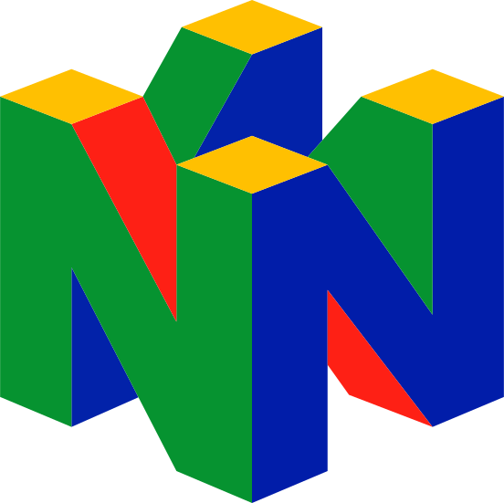

# SimpleN64Demo 

Simple Nintendo64 application using Nintendo libraries.

```text
├── SimpleN64Demo       // Demo using libultra
└── SimpleN64DemoNusys  // Demo using NuSystem abstraction layer
```

## Setup toolchain and SDK

### Building on host

For Debian/Ubuntu run:

```bash
make deps
```

then run:

```bash
./setup_n64_toolchain.sh
```

This will take a while (the n64chain will take about 1GB disk space when done). </br>
After that just source the init script like so:

```bash
source init_n64_env.sh
```

### Building using Docker

This is the easiest way to build the toolchain, just run:

```bash
make setup
```

Then run:

```bash
make build
```

To build the N64 apps.

## Problems

If you get an error message when building stating something like:

```bash
../mips64-elf/bin/as: error while loading shared libraries: libopcodes-2.34.so: cannot open shared object file: No such file or directory
```

You will need to set LD_LIBRARY_PATH to point to the lib directory of the toolchain:

```bash
export LD_LIBRARY_PATH=$LD_LIBRARY_PATH:$N64_TOOLCHAIN/tools/x86_64-pc-linux-gnu/mips64-elf/lib/
```

## Emulators

<https://github.com/n64dev/cen64>

```bash
alias cen64mt="cen64 -multithread -noaudio $N64_TOOL_CHAIN/tools/bin"
```

## Misc

### Useful links

Awesome N64 Development
<https://n64.dev/>

Nintendo 64 Development Resource
<https://ultra64.ca/>

Function Reference
<https://ultra64.ca/files/documentation/online-manuals/man-v5-2/allman52/n64man/n64man.htm>

Nintendo N64 Source code Programming - A Basic Introduction
<https://www.youtube.com/watch?v=68nFnspMPfM>

Debugging Nintendo 64 ROMs with GDB and Cen64
<https://www.youtube.com/watch?v=IPiZqg-2CrA>

Wavefront OBJ model converter that generates optimized N64 displaylists for compilation with libultra.
<https://github.com/n64dev/objn64>
